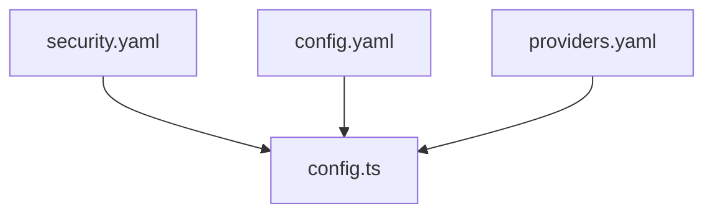

Passage is configured declaratively with YAML, validated by Zod schemas. Configs are
environment-aware: `template.*.yaml` in development, `production.*.yaml` in production.

## Config structure

## Providers

### Adding an OIDC provider

> "OpenID Connect, popularly abbreviated as OIDC, is a protocol that enables different types of
> applications to support authentication and identity management in a secure, centralized, and
> standardized way. Apps based on the OpenID Connect protocol rely on identity providers to handle
> authentication processes for them securely and to verify the identities (i.e., personal
> attributes) of their users."
> — From the OIDC Handbook by Bruno Krebs of Auth0 (pg. 19)

#### Planning multiple authentication domains

Planning authentication domains is a critical step in the process of adding a new provider.

1. OIDC permits well-known domains for authentication. You can choose one provider per domain (or
   subdomain), but more than one OIDC provider cannot live within a single root domain.
   - e.g., choose `cstmr.auth.corporate.com` for customer OIDC, and `staff.auth.corporate.com` for
     staff OIDC.
2. Plan your authentication providers to be able to handle multiple domains (e.g., use stacked
   providers).

#### Adding the provider to `providers.yaml`

Within the `/config/` directory, modify the `providers.yaml` file. Each provider declares its
upstream issuer, client credentials (via a KMS reference), scopes, and this server's own issuer.
See the [API Reference](/docs/api) for the full provider config shape.
